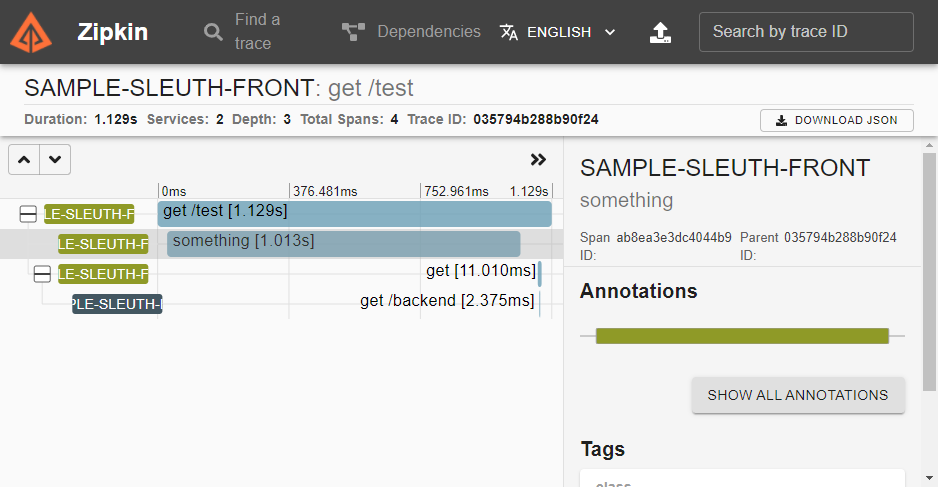
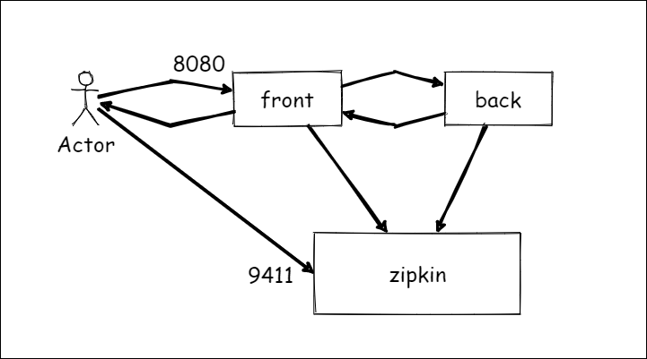

# spring sleuth(zipkin) sample

## overview

spring sleuth を使って可視化されるトレースのサンプルプロジェクト  
二種類のシステム間のAPI呼び出しがトレースされる様子が見れる。

## 試し方

### traceの確認

```PS
PS> ./mvnw spring-boot:build-image
PS> docker-compose up -d
PS> curl http://localhost:8080/test
```

任意のブラウザで、 `http://localhost:9411` にアクセス。

表示されるトレースを確認。



### ログの確認

```PS
PS> ./mvnw spring-boot:run -rf back
PS> curl http://localhost:8080/backend
```

上記のようにアクセスを行うと、ログの中にTraceIDが出力される。

```
  :
  :
2020-12-14 12:03:54.987  INFO [sample-sleuth-back,715e7779a0ea38e8,715e7779a0ea38e8] 4480 --- [nio-8080-exec-1] j.g.s.s.b.SampleSleuthBackApplication    : loglog
```

出力されたTraceID,SpanIDは上位からのアクセスと紐づいた同一の値が設定される。

## 仕組み

Bean登録された、RestTemplate/WebClientを使用して外部通信をした場合に自動で適用される。  

具体的には、リクエストのHTTPヘッダに特定の拡張ヘッダでTraceIDを引き渡す。  
受け取る側が同様の仕組みにのっとって作られている場合、このヘッダを受け取り、アプリケーションのトランザクションと紐づける

それぞれのアプリケーションが、zipkinサーバに対して、設定された組み込まれたタイミングのspan（画像の一つの帯）を発信する。

これらを受けとったzipkinサーバが情報を保持して、可視化する。

### 任意のspan

`@NewSpan` というアノテーションを付与することで任意のタイミングでspanを切ることができる。  
これ以外にも、Spring Bootの組み込み済みのタイミングで発行される。

### システムの構造


